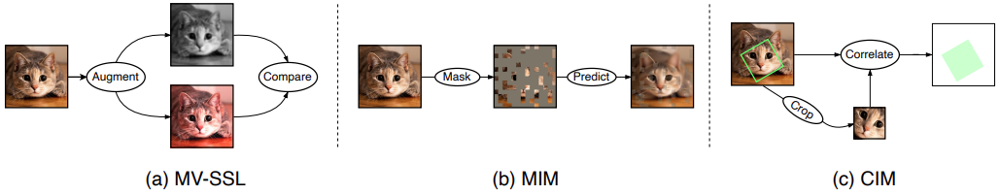

# Correlational Image Modeling for Self-Supervised Visual Pre-Training

## Introduction

This repository contains the official PyTorch implementation of the following paper:

> [**Correlational Image Modeling for Self-Supervised Visual Pre-Training**](https://arxiv.org/abs/2206.07706),  
> Wei Li, Jiahao Xie, Chen Change Loy  
> In: The IEEE/CVF Conference on Computer Vision and Pattern Recognition (CVPR), 2023  
> [[arXiv](https://arxiv.org/abs/2303.12670)][[[Bibtex](https://github.com/weilivision/Correlational-Image-Modeling#citation)]



## Updates

- [07/2023] Code and models are released.

## Installation

Please refer to [INSTALL.md](docs/INSTALL.md) for installation and dataset preparation.

## Pre-training

Please refer to [PRETRAIN.md](docs/PRETRAIN.md) for the pre-training instruction.

## Fine-tuning

Please refer to [FINETUNE.md](docs/FINETUNE.md) for the fine-tuning instruction.


### ViT

**ImageNet-1K Pre-trained and Fine-tuned Models**

| Method  | Backbone | Pre-train epochs | Fine-tune epochs | Top-1 acc (%) | Pre-trained model | Fine-tuned model |
|---------|:--------:|:----------------:|:----------------:|:-------------:|:-----------------:|:----------------:|
| CIM      | ViT-B/16 |        300       |        100       |      83.1     | [model](https://drive.google.com/file/d/1V5SqYIE6-RlWbA9MxudYK9p9ZQYCl2jp/view?usp=drive_link)|[model](https://drive.google.com/file/d/1asFi9ei3UzL9nR2_-DRKt4b4X4r8yb0T/view?usp=drive_link)|


## Citation

If you find our work useful for your research, please consider giving a star :star: and citation :beer::

```bibtex
@inproceedings{li2023correlational,
  title={Correlational Image Modeling for Self-Supervised Visual Pre-Training},
  author={Li, Wei and Xie, Jiahao and Loy, Chen Change},
  booktitle={CVPR},
  year={2023}
}
```

## Acknowledgement

This code is built using the [mae](https://github.com/facebookresearch/mae) library.